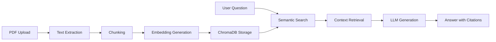

# 📚 Doc-AMA: RAG PDF Q&A System

A **Retrieval-Augmented Generation (RAG)** system for PDF documents that allows you to upload PDFs and ask questions about their content with AI-powered answers and accurate citations.

## 🎯 Features

- **PDF Document Processing**: Extract and chunk text from multiple PDF files
- **Semantic Search**: Find relevant content using vector embeddings
- **AI-Powered Q&A**: Generate accurate answers using OpenRouter LLMs
- **Citation System**: Get proper source attribution with page numbers
- **Web Interface**: User-friendly Gradio interface for document upload and chat
- **Multiple Model Support**: Choose from various LLMs via OpenRouter

## 🏗️ Architecture



**Components:**
- **PDF Processor**: Extracts and chunks PDF text
- **Vector Store**: ChromaDB for semantic document search
- **LLM Client**: OpenRouter integration for AI responses
- **RAG System**: Orchestrates retrieval and generation
- **Gradio UI**: Web interface for user interaction

## 🚀 Quick Start

### Prerequisites

- Python 3.13+
- OpenRouter API key ([Get one here](https://openrouter.ai/))

### Installation

1. **Clone and setup**:
```bash
git clone <your-repo-url>
cd doc-ama
python -m venv .venv
source .venv/bin/activate  # On Windows: .venv\Scripts\activate
```

2. **Install dependencies**:
```bash
pip install -r requirements.txt
```

3. **Configure environment**:
```bash
cp .env.template .env
# Edit .env with your OpenRouter API key
```

4. **Run the application**:
```bash
python main.py
```

5. **Open your browser** to `http://localhost:7860`

## ⚙️ Configuration

Create a `.env` file with these settings:

```bash
# Required: OpenRouter API Configuration
OPENROUTER_API_KEY=your_api_key_here
OPENROUTER_BASE_URL=https://openrouter.ai/api/v1
DEFAULT_MODEL=meta-llama/llama-3.1-8b-instruct:free

# Optional: Advanced Configuration
EMBEDDING_MODEL=all-MiniLM-L6-v2
CHROMA_PERSIST_DIRECTORY=./chroma_db
CHUNK_SIZE=1000
CHUNK_OVERLAP=200
MAX_SEARCH_RESULTS=5
MAX_PDF_SIZE_MB=50

# Optional: UI Configuration
GRADIO_HOST=127.0.0.1
GRADIO_PORT=7860
GRADIO_SHARE=false
```

## 📖 Usage

### 1. Upload Documents
- Navigate to the **"Upload Documents"** tab
- Select one or more PDF files (max 50MB each)
- Click **"Process Documents"** to extract and index content

### 2. Ask Questions
- Go to the **"Ask Questions"** tab
- Type your question about the uploaded documents
- Get AI-powered answers with source citations
- Use filters to search specific documents

### 3. Monitor System
- Check the **"System Status"** tab for health monitoring
- View processing statistics and API usage

## 🛠️ Development

This project is designed as a learning scaffolding. Each module contains detailed TODOs and learning guidance.

### Project Structure

```
doc-ama/
├── src/
│   ├── pdf_processor.py      # PDF text extraction and chunking
│   ├── vector_store.py       # ChromaDB integration
│   ├── llm_client.py         # OpenRouter LLM client
│   ├── rag_system.py         # RAG pipeline orchestration
│   └── gradio_ui.py          # Web interface
├── main.py                   # Application entry point
├── requirements.txt          # Dependencies
├── .env.template            # Configuration template
├── LEARNING_PLAN.md         # Comprehensive learning guide
└── README.md                # This file
```

### Implementation Progress

The project is currently a **scaffolding** with detailed TODOs. To make it functional:

1. **Uncomment imports** in each module
2. **Implement TODO functions** following the guidance provided
3. **Set up API keys** and test connections
4. **Follow the learning plan** in `LEARNING_PLAN.md`

### Key Learning Areas

- **Vector Embeddings**: Understanding semantic similarity
- **RAG Architecture**: Retrieval + generation patterns
- **LLM Integration**: API usage and prompt engineering
- **Document Processing**: PDF parsing and text chunking
- **Web Interfaces**: Gradio components and state management

## 📚 Learning Resources

See `LEARNING_PLAN.md` for:
- Comprehensive 8-week learning curriculum
- Implementation roadmap with sprints
- Hands-on exercises and debugging guides
- Key concepts and recommended resources
- Progress tracking templates

## 🧪 Testing

Example questions to test your system:

```
"What are the main topics covered in this document?"
"Can you summarize the key findings from page 5?"
"What methodology was used in the research?"
"Who are the authors mentioned in the conclusion?"
```

## 🔧 Troubleshooting

### Common Issues

**PDF Processing Problems:**
- Encrypted PDFs: Check if password-protected
- Scanned PDFs: May need OCR capabilities
- Large files: Increase `MAX_PDF_SIZE_MB` limit

**API Issues:**
- Invalid API key: Verify OpenRouter credentials
- Rate limiting: Implement exponential backoff
- High costs: Monitor token usage carefully

**ChromaDB Issues:**
- Permission errors: Check directory write permissions
- Memory usage: Reduce batch sizes for large documents

**Quality Issues:**
- Poor retrieval: Adjust similarity thresholds
- Bad citations: Improve prompt engineering
- Slow responses: Optimize chunk sizes and context length

### Getting Help

1. Check the detailed TODOs in each module
2. Follow the learning plan step-by-step
3. Test individual components before integration
4. Use logging to debug pipeline issues

## 🚀 Deployment

For production deployment:

1. **Environment Setup**:
   - Use production-grade API keys
   - Configure proper logging
   - Set up monitoring and alerts

2. **Scalability**:
   - Consider Docker containers
   - Use cloud vector databases for scale
   - Implement caching for frequent queries

3. **Security**:
   - Add user authentication
   - Secure API key storage
   - Validate file uploads thoroughly

## 🤝 Contributing

This is a learning project! Feel free to:
- Implement the TODO functions
- Add new features and capabilities
- Improve documentation and examples
- Share your learning experience

## 📄 License

MIT License - feel free to use this for learning and building!

## 🙏 Acknowledgments

- **OpenRouter** for LLM access
- **ChromaDB** for vector storage
- **Gradio** for the web interface
- **Sentence Transformers** for embeddings
- **LangChain** community for RAG patterns

---

**Ready to learn RAG? Start with `LEARNING_PLAN.md` and begin implementing! 🚀**